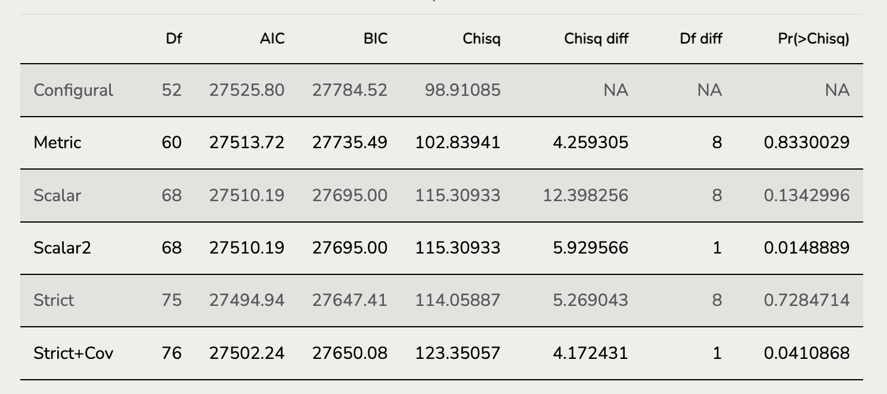

```{r setup, include=FALSE, message=FALSE}
# close echo until you want to echo your codes.
knitr::opts_chunk$set(echo = FALSE, message = FALSE, warning = FALSE)
```

> Recently, I was asked by my friend why should we use Measurement Invariance in real research. Why not just ignore this complex and tedious process? As far I'm concerned, measurement invariance should be widely used if you have large data scale and figure out what's going on between groups difference. In this post, I want to elaborate some problems in **Measurement Invariance**: 1) What is measurement invariance 2) why should we care about measurement invariance 3) how to do measurement invariance using R `Lavaan` Package.



# What and Why?

In my advisor Jonathan's lectures slides, **measurement invariance** (MI) is a testing procedure in latent variable modeling to investigate "*whether indicators measure the same construct in the same way in different groups or over time/condition*".

It is a neat and clear definition of MI. In my opinion, we should first know different piles of variances of indicator responses. We know that in CFA, latent trait is identified by covariances among indicators (observable features). Imaging item responses have "significant" group differences (e.g., male vs. female, international students with native speakers), then there are at least three sources of deviations between groups:

1.  the scale measures varied trait(s) for different groups (e.g., for group A, the scale actually measures trait $\alpha$ while the scale measures trait $\beta$ for group B)
2.  the difference of true latent trait ($\theta$; the scale scores for group A has varied location and scale with the scale scores for group B)
3.  the difference of item effects on trait ($\lambda$; the scale items have varied difficulties/discrimination between group A and group B).

The first two points are straightforward. Taking an international math assessment for example, it may measure native speaker's math ability while it may also measure English proficiency of international students. Or if male and female have different math ability, they might (not must) have different item responses on math assessment.

The third point suggests that even for two groups with exactly same average level of target trait, they will still have different item properties since same item have different power to measure the latent trait for male and female. For example, one item of Daily Living Ability Survey is "*How often do you cook in a week?*". The item may be biased toward men, because most males may hate cooking (that is a stereotype!!!) but still have high daily living ability (such as driving, fixing), some females loving cooking but have low daily living ability. Thus, this item doesn't account for female's or men's daily ability at same extent.

Actually all parameters in CFA model (e.g., factor variances, factor covariance, factor means, factor loadings, item intercepts and residential variances, co-variances) could be potentially different across groups, which leads to some problems in interpreting results. In psychometrics, the MI is splitted into multiple parts:

1.  Testing the difference coming from factor part is called Structural invariance.
2.  Testing the difference coming from measurement part is called Measurement invariance.

In previous paragraph, the first two differences are measured by Structural Invariance. The 3rd differences are measured by Measurement Invariance.

## An example of Multiple Group CFA Invariance:

This example data is from Brown Chapter 7. Major Depression Criteria across Men and Women (n =345)

9 items rated by clinicians on a scale of 0 to 8 (0=none, 8 =very severely disturbing/disabling)

1.  Depressed mood
2.  Loss of interest in usual activities
3.  Weight/appetite change
4.  Sleep disturbance
5.  Psychomotor agitation/retardation
6.  Fatigue/loss of energy
7.  Feelings of worthless/guilt
8.  Concentration difficulties
9.  Thoughts of death/suicidality

Jonathan in his Measurement Invariance Example elaborated the manual version so that learner could learn what you are doing first. I will show you how to use shortcuts.

### Data Import

```{r packages, echo=FALSE, message=FALSE,warning=FALSE}
library(lavaan)
# library(semPlot)
library(knitr)
# library(kableExtra)
library(tidyverse)
library(here)
```

```{r}
root_dir <- "~/Documents/Projects/website-jihong/posts/2017-11-12-MESUREMENT-INVARIANCE"
mddAll = read.table(file = here(root_dir, "MDDALL.dat"), header = FALSE, 
                    quote = "", na.strings = "99999")

# use dim() to check the dimensions of data
# there are 750 rows and 10 columns
colnames(mddAll) = c("sex", paste0("item",1:9)) # assign names, first col is sex, another 9 are items

head(mddAll) # check the first several rows of data


#recoding sex to specify each group name, set it as factors
mddAll$sex <- mddAll$sex %>% 
  as.factor() %>% 
  recode(`0` = "Female", `1` = "Male", .default = levels(mddAll$sex))

ggplot(mddAll |> group_by(sex) |> summarise(Freq = n())) +
  geom_col(aes(x = sex, y = Freq, fill = sex)) +
  geom_text(aes(x = sex, y = Freq, label = Freq), nudge_y = .8)
  
# stardard deviation
# dat1.sd <- as.vector(data[2,]) %>% as.numeric()
# dat2.sd <- as.vector(data[19,]) %>% as.numeric()
# dat1.cov <- cor2cov(R = dat1, sds = dat1.sd) %>% as.matrix()
# dat2.cov <- cor2cov(R = dat2, sds = dat2.sd) %>% as.matrix()

```

The sample size of female reference groups is as same as the male. The model for 2 groups should be same and check how many changes are allowed to differ.

### Model Specification

```{r eval=TRUE, echo=TRUE, results='asis'}
#| code-fold: show
model1.config <- "
# Constrain the factor loadings and intercepts of marker variable in ALL groups
# depress =~ c(L1F, L1M)*item1 + c(L2F, L2M)*item2 + c(L3F, L3M)*item3 +
#            c(L4F, L4M)*item4 + c(L5F, L5M)*item5 + c(L6F, L6M)*item6 + 
#            c(L7F, L7M)*item7 + c(L8F, L8M)*item8 + c(L9F, L9M)*item9
depress =~ item1 + item2 + item3 +
           item4 + item5 + item6 + 
           item7 + item8 + item9

#Item intercepts all freely estimated in both groups with label for each group
item1 ~ 1; item2 ~ 1; item3 ~ 1; 
item4 ~ 1; item5 ~ 1; item6 ~ 1; 
item7 ~ 1; item8 ~ 1; item9 ~ 1;

#Redidual variances all freely estimated with label for each group
item1 ~~ item1; item2 ~~ item2; item3 ~~ item3; 
item4 ~~ item4; item5 ~~ item5; item6 ~~ item6; 
item7 ~~ item7; item8 ~~ item8; item9 ~~ item9;

#Residual covariance freely estimated in both groups with label for each group
item1 ~~ item2

#==================================================
#Factor variance fixed to 1 for identification in each group
depress ~~ c(1,NA)*depress

#Factor mean fixed to zero for identification in each group
depress ~ c(0,NA)*0
"
```

### Model Options

Configural Invariance Model is the first-step model which allows all estimation different for two groups except that mean and variance of factor are fixed to 0 and 1, because the model uses z-score scalling.

Compared to configural invariance, metic invariance model constrains the factor loadings for two groups equal with each other. To test metric invariance, we could use absolute model fit indices (CFI, TLI, RMSEA, SRMR) and comparable model fit indices (Log-likelihood test). It deserves noting that in metric invariance model, factor means are still constrained to be equal for two groups but the variances of factor are different. The variance of factor for reference group is fixed to 1 but that for other group is free to estimate. Since if we constrain both factor loadings and factor variances to equal, then the residual variances of items will also be equal. This is next step. Freeing one group's factor variance will let model not too strict to Residual Variance.

Next model is Scalar Invariance Model, which constrain the intercepts of items to be equal.

```{r , echo=TRUE}
fit.config <- sem(model1.config, data = mddAll, 
                  meanstructure = T , std.lv = T,
                  estimator = "MLR", mimic = "mplus",
                  group = "sex",
                  group.equal = c("lv.variances", "means")) # latent variance both equal to 1
                  
fit.metric <- sem(model1.config, data = mddAll, 
                  meanstructure = T , std.lv = T,
                  estimator = "MLR", mimic = "mplus",
                  group = "sex",
                  group.equal = c("loadings", "means")) # factor mean should be equal to 0
fit.scalar <- sem(model1.config, data = mddAll, 
                  meanstructure = T , std.lv = T,
                  estimator = "MLR", mimic = "mplus",
                  group = "sex",
                  group.equal = c("loadings","intercepts"))
# same: factor loadings, item intercepts
# different: reference factor mean is 1, another factor mean is 0

fit.scalar2 <- sem(model1.config, data = mddAll, 
                  meanstructure = T , std.lv = T,
                  estimator = "MLR", mimic = "mplus",
                  group = "sex",
                  group.equal = c("loadings","intercepts"),
                  group.partial = c("item7~1"))

fit.strict <- sem(model1.config, data = mddAll, 
                  meanstructure = T , std.lv = T,
                  estimator = "MLR", mimic = "mplus",
                  group = "sex",
                  group.equal = c("loadings","intercepts", "residuals"),
                  group.partial = c("item7~1", "item7~~item7"))
fit.strict.cov <- sem(model1.config, data = mddAll, 
                  meanstructure = T , std.lv = T,
                  estimator = "MLR", mimic = "mplus",
                  group = "sex",
                  group.equal = c("loadings","intercepts", "residuals", 
                                  "residual.covariances"),
                  group.partial = c("item7~1", "item7~~item7"))
```

### Runing Model

```{r , echo=TRUE}
summary(fit.config, fit.measures = TRUE, rsquare = TRUE, standardized = TRUE)
summary(fit.metric, fit.measures = TRUE, rsquare = TRUE, standardized = TRUE)
summary(fit.scalar, fit.measures = TRUE, rsquare = TRUE, standardized = TRUE)
summary(fit.scalar2, fit.measures = TRUE, rsquare = TRUE, standardized = TRUE)
summary(fit.strict, fit.measures = TRUE, rsquare = TRUE, standardized = TRUE)
summary(fit.strict.cov, fit.measures = TRUE, rsquare = TRUE, standardized = TRUE)
```

### Model Comparison

```{r ,echo=TRUE}
model_fit <-  function(lavobject) {
  vars <- c("cfi", "tli", "rmsea", "rmsea.ci.lower", "rmsea.ci.upper", "rmsea.pvalue", "srmr")
  return(fitmeasures(lavobject)[vars] %>% data.frame() %>% round(2) %>% t())
}

table_fit <- 
  list(model_fit(fit.config), model_fit(fit.metric), 
       model_fit(fit.scalar), model_fit(fit.scalar2),
       model_fit(fit.strict), model_fit(fit.strict.cov)) %>% 
  reduce(rbind)

rownames(table_fit) <- c("Configural", "Metric", "Scalar", "Scalar2","Strict","Strict+Cov")

table_lik.test <- 
  list(anova(fit.config, fit.metric),
       anova(fit.metric, fit.scalar),
       anova(fit.scalar, fit.scalar2),
       anova(fit.scalar2, fit.strict),
       anova(fit.strict, fit.strict.cov)
       ) %>%  
  reduce(rbind) %>% 
  .[-c(3,5,7,9),]
rownames(table_lik.test) <- c("Configural", "Metric", "Scalar", "Scalar2","Strict","Strict+Cov")

kable(table_fit, caption = "Model Fit Indices Table")
kable(table_lik.test, caption = "Model Comparision Table")

```

## STRUCTUAL INVARIANCE TESTS

### Factor Variance Invariance Model

```{r}
fit.structuralVariance <- sem(model1.config, data = mddAll, 
                  meanstructure = T , std.lv = T,
                  estimator = "MLR", mimic = "mplus",
                  group = "sex",
                  group.equal = c("loadings","intercepts", "residuals", 
                                  "lv.variances"),
                  group.partial = c("item7~1", "item7~~item7"))
summary(fit.structuralVariance, fit.measures = TRUE, rsquare = TRUE, standardized = TRUE)
anova(fit.strict,fit.structuralVariance)
```

### Factor Mean Invariance Model

```{r}
fit.structuralMean <- sem(model1.config, data = mddAll, 
                  meanstructure = T , std.lv = T,
                  estimator = "MLR", mimic = "mplus",
                  group = "sex",
                  group.equal = c("loadings","intercepts", "residuals", 
                                  "lv.variances", "means"),
                  group.partial = c("item7~1", "item7~~item7"))
summary(fit.structuralMean, fit.measures = TRUE, rsquare = TRUE, standardized = TRUE)
```

### Model Comparison

```{r}
table_fit <- 
  list(model_fit(fit.config), model_fit(fit.structuralVariance), 
       model_fit(fit.structuralMean)) %>% 
  reduce(rbind)

rownames(table_fit) <- c("Configural", "structuralVariance", "structuralMean")

table_lik.test <- 
  list(anova(fit.config, fit.structuralVariance),
       anova(fit.structuralVariance, fit.structuralMean)
       ) %>%  
  reduce(rbind) %>% 
  .[-3,]
rownames(table_lik.test) <- c("Configural", "structuralVariance", "structuralMean")

kable(table_fit, caption = "Model Fit Indices Table")
kable(table_lik.test, caption = "Model Comparision Table")
```
