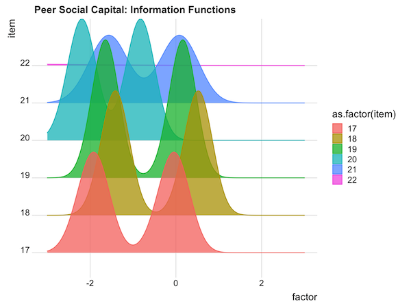

This blog is to show a new way to display item information curves using `ggridges` package. The ridge plot could show the IIF plots very clear when you have a large number of items.

```{r, eval=FALSE}
ggplot(item_information_all %>% filter(item %in% 17:22)) +
  aes(x = factor, y = item, height = info, 
      group = item, color = as.factor(item), 
      fill = as.factor(item)) +
  ggridges::geom_ridgeline(alpha = 0.75) +
  ggtitle("Peer Social Capital: Information Functions")  +
  theme_ridges()
```
