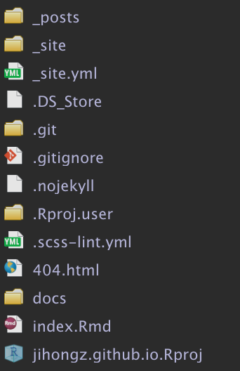
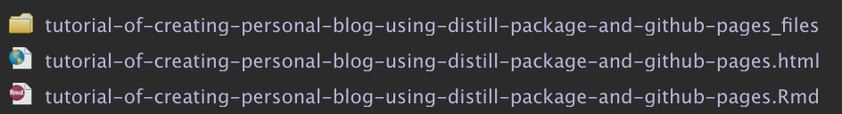
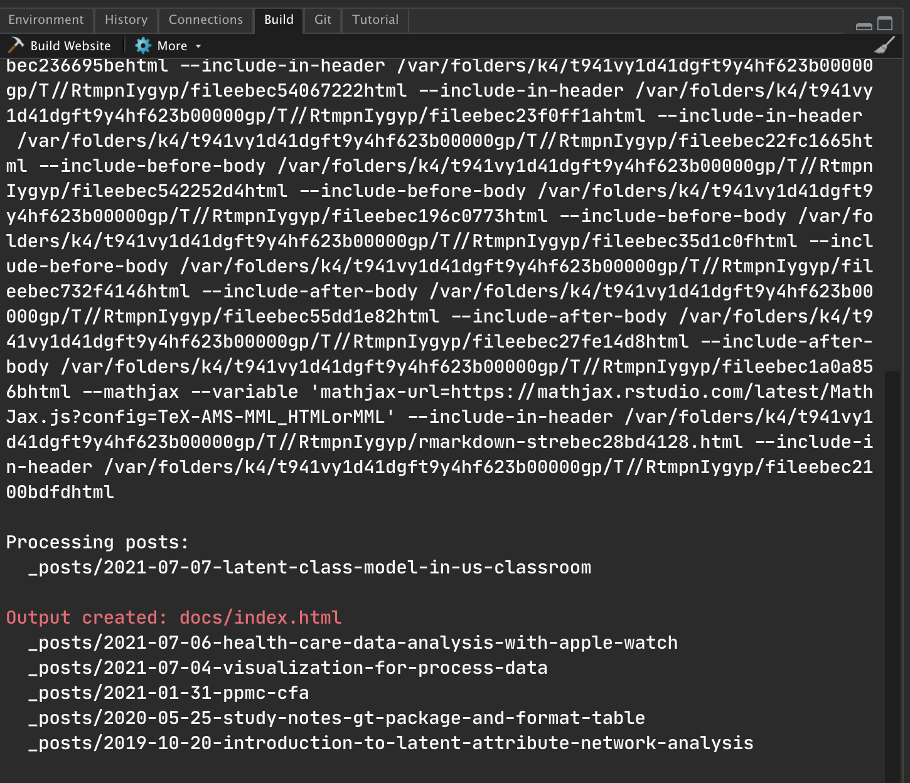
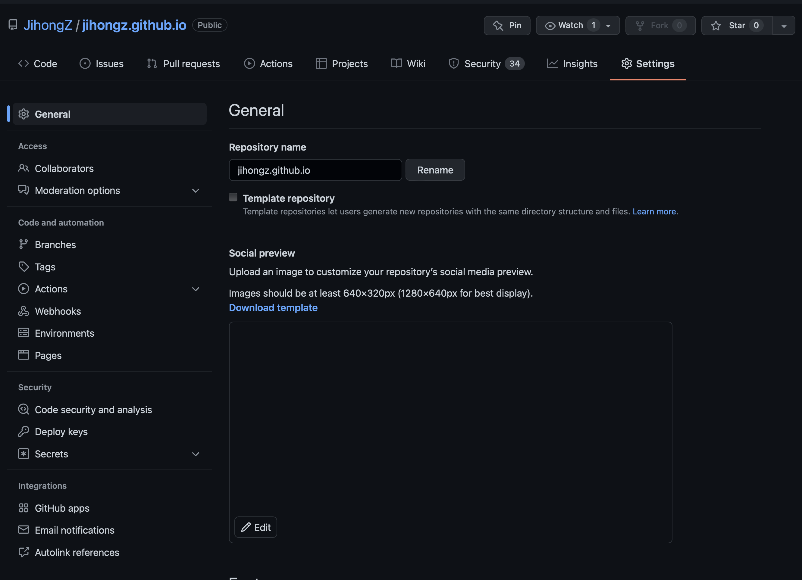
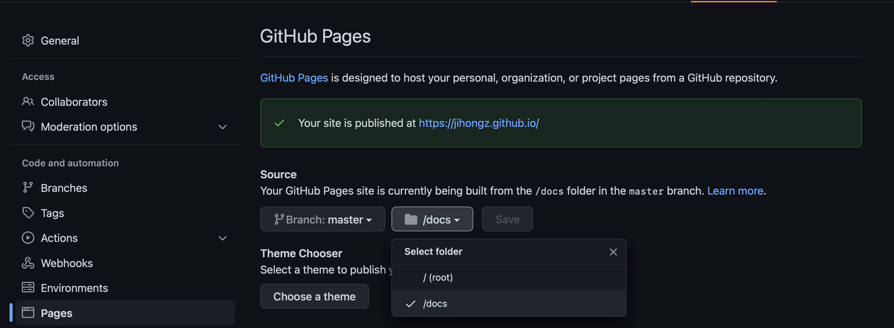

```{r setup, include=FALSE}
knitr::opts_chunk$set(echo = FALSE, fig.align = "center", eval=FALSE)
```

## Resource

[Michael Clark](https://m-clark.github.io/distill-workshop) has a great workshop in his blog introducing distill package. I suggest readers check it out first.

## Requirement

Following software is necessary to replicate the steps in this post:

-   Github account
-   Rstudio and R
-   <mark>distill</mark> R package

To get started with Github, please refer to the [official website](https://docs.github.com/en/get-started/signing-up-for-github/signing-up-for-a-new-github-account). To install *distill* package, run `install.packages("distill")` in your R console.

## Procedure

To create a website with the URL \<username.github.io\>, create the directory name with same name and same Github repo name. For example, my github repo name is "jihongz.github.io", and it is published in <http://jihongz.github.io>.

```{r, echo=FALSE, fig.cap="Flowchart for creating website", eval=TRUE}
knitr::include_graphics(path = "img/flowchart.png")
```

To have your personal website, you need to have all require files for the website. The basic files for Github Pages based website with distill includes:

1.  \_site.yml
2.  index.Rmd
3.  .nojekyll
4.  \_posts



## New Post

To create a new post, use `distill::create_post()` function with the name of the post. The function will create a new directory "2022-XX-XX-post-name" in the *\_posts* folder in which there exists a Rmd file with same name. The Rmd file will be your content of the new post.

```{r echo=TRUE, message=FALSE, warning=FALSE, eval=FALSE}
distill::create_post(title = "Tutorial of creating personal blog using distill package and Github Pages")
```



Open the Rmd file and make sure the header of your Rmd file is like this:

```         
---
title: "[Tutorial] Creating Academic Blog"
description: |
  This post reviews the procedure of creating Github Pages Website  using distill package and Github Pages in a step-to-step way.
author:
  - name: Zhang Jihong
    url: {}
date: 2022-04-24
output:
  distill::distill_article:
    self_contained: false
---
```

After editting the Rmd file, knit the fill and then build website using *Build Website* button in the Build pane of Rstudio.



It will then pop up your updated website in a window.


However, the website is not published yet. To publish the website, upload the files to Github. Following is a example of pushing the local files to the Github server via command line.

```{bash, echo = TRUE}
git add *
git commit -m "create a new post"
git push
```

### Settings of Github Repo

Go to the Github Repo \> Settings \> Pages



In the webpage, choose *\_docs* and you will see your website is published.



## Reference

Learn more about using Distill at <https://rstudio.github.io/distill>.
