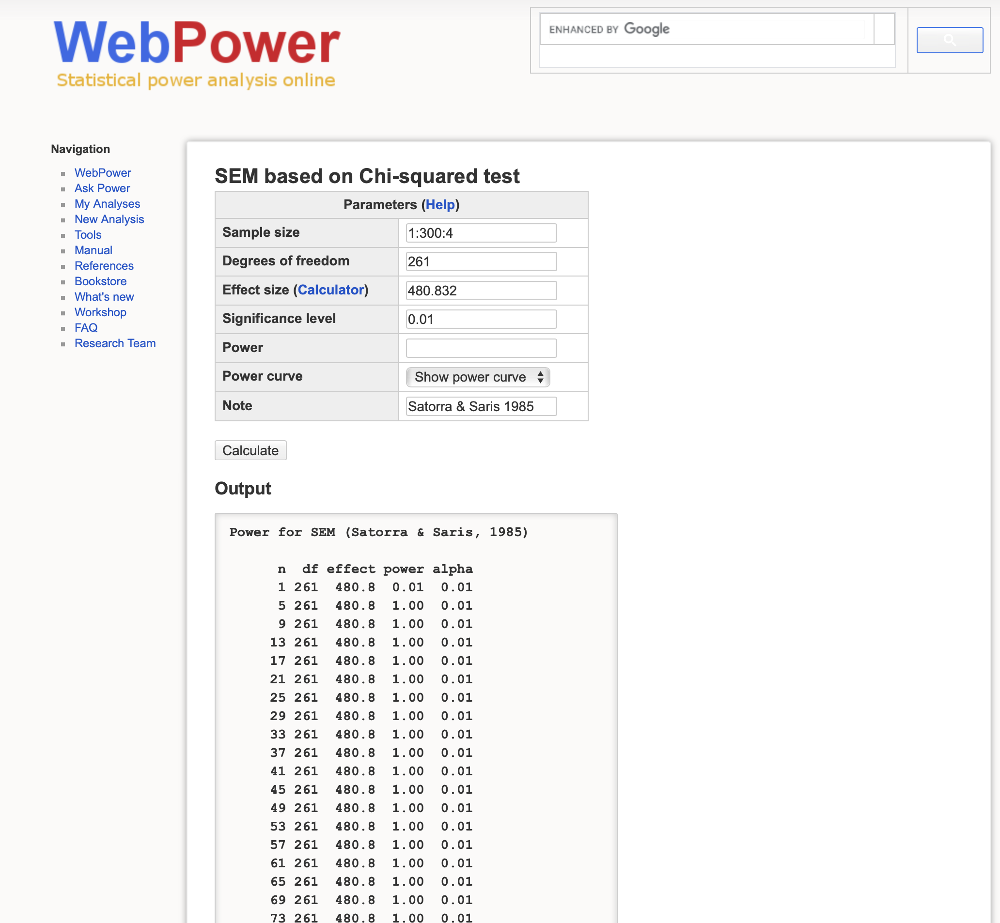
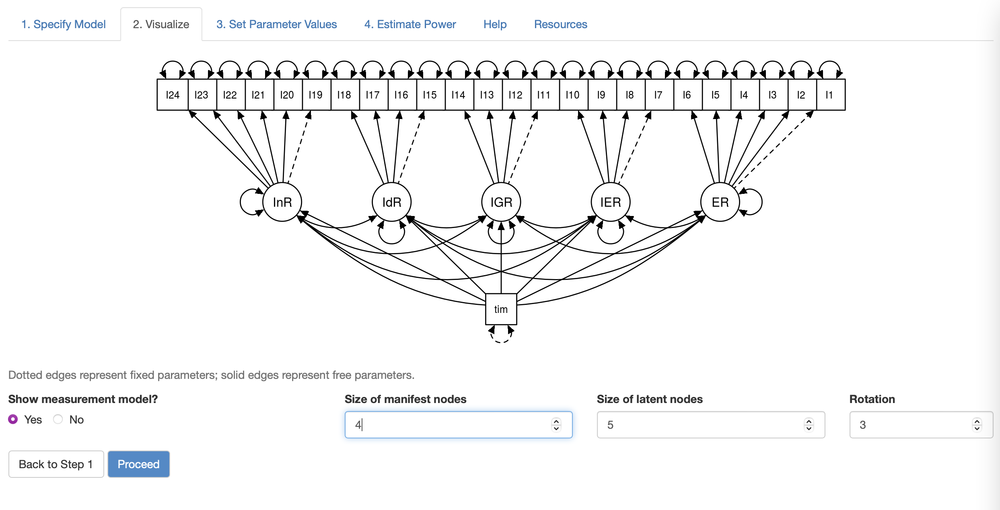
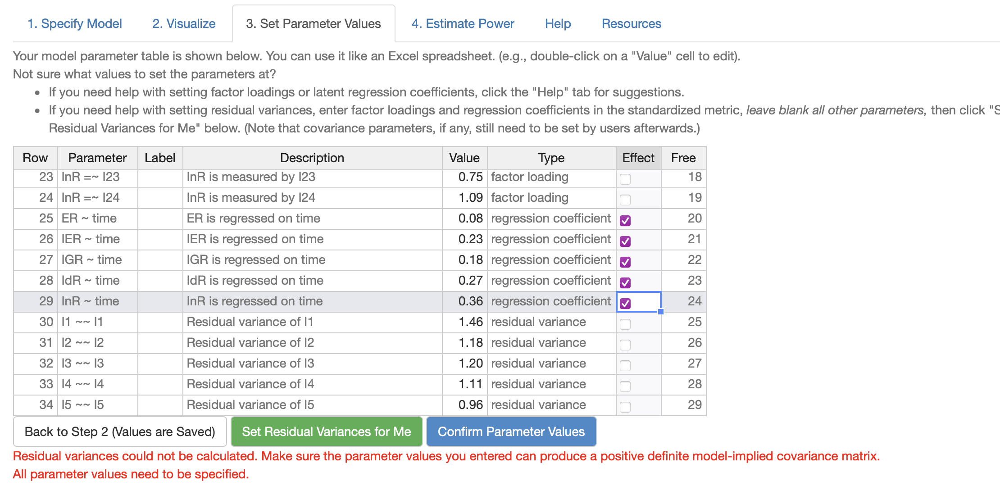
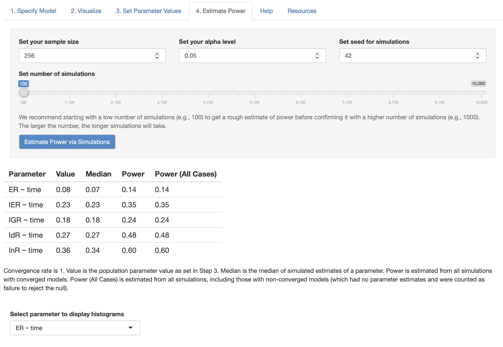
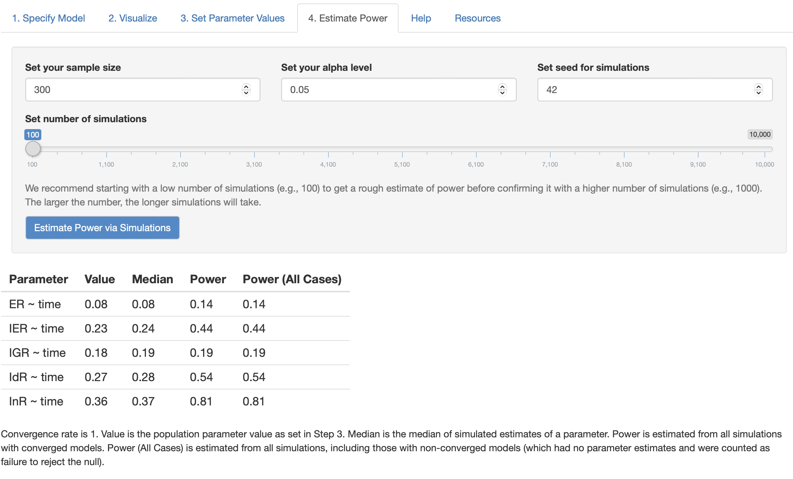
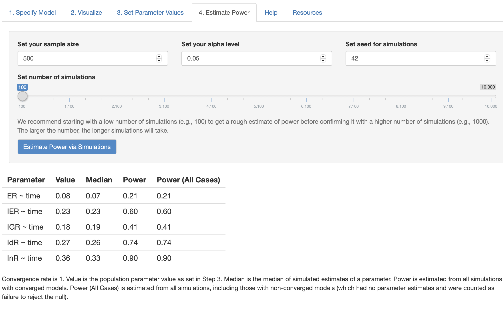

```{r setup, include=FALSE}
knitr::opts_chunk$set(echo = FALSE, fig.align = "center")
```

The statistical power of a hypothesis test is the probability of detecting an effect, if there's a true effect presented to detect. <mark>Power</mark>, defined as **the confidence in the conclusions drawn from the results**, plays an important role of determining the minimum sample size (number of observation) required to detect an effect in an experiment. The power analysis of SEM is often ignored in application research partly because few guidelines exist for researchers to conduct power analysis in SEM framework. This tutorial introduces two web tools which can be used to conduct power analysis for Structural Equation Modeling (SEM). An empirical example of my own research on students' time effect on academic motivations will also be presented for illustration. For privacy, only short name of the latent constructs are used.

@wang_power_2021 argued that there're two ways of determining sample size planning in SEM: (1) traditional rule of thumbs, (2) power analysis for SEM based on parameter effect size and model misspecification. To be more specific, two ways of determining sample size planning in SEM are:

1.  Rules of thumbs based absolute minimum sample size: N = 100 or N = 200
2.  Model Complexities based relative sample size: N = 5-10 or N = 3-6 per estimated parameters

These two ways of determining minimum sample sizes may not agree with each other and have few theoretical or empirical research support. According to the objective of hypothesis test in SEM, there are two distinct kinds of power: (1) the power of detecting model misspecification, (2) and the power of determining specific effects within the model (i.e., whether one latent variable predicts another). In this tutorial, I called the former one <mark>global power</mark> and latter one <mark>local power</mark> since the global power analyzes the model-level effect size of misfit while the local power tests the effect size of a particular model parameter.

# Global Power

As mentioned above, global power is a test quantifying the degree of confidence of the hypothesis test of model misspecification. There are many fit indices for power analysis for model misspecification including:

1.  Satorra and Saris's (1985) $\chi^2$ likelihood-ratio test
2.  MacCallum et al.'s (1996) root-mean-square error of approximation (RMSEA) tests

For the first test, I recommend using [WebPower](https://webpower.psychstat.org/models/sem02/), a free web tool, to calculate global power based on Chi-square likelihood-ratio test (LRT). The test examines the misspecification by comparing the user model to the null model with the hypothesis that the hypothesized model is same as the null model. Most of cases will reject the hypothesis. WebPower tests the global power of SEM based on chi-square likelihood ratio test.

```{r, echo=FALSE, fig.cap="Chi-square LR test"}

```

Input the chi-square test with 480.82 and vary the sample size from N=1 to N=300, we found N = 5 is enough sample size for power up to 1. Thus, normally SEM based on Chi-square LRT to null model has very low bar for misspecification. In this case, perhaps doubling the sample size (N $\times$ 2 = 261 $\times$ 2 = 522) is a more reasonable rule of thumb of minimum sample size.

# Local Power

@wang_power_2021 recommend a Monte Carlo simulation approach to calculate power for detecting a target effect in SEM and introduced [pwrSEM](http://yilinandrewang.shinyapps.io/pwrSEM/), a Shiny web app to estimate the power of parameter in SEM.

Let's take one mixture Confirmatory factor analysis with known classes (time = 0, time = 1) for example. The goal is to estimate the power of time effects on five latent constructs with sample size ($N = 256$).

The model has been fitted to the data using *`lavaan`* package beforehand. After opening up the [shiny app](https://yilinandrewang.shinyapps.io/pwrSEM/), we can copy and paste the model syntax from `lavaan` to the app. Then the model specification will be visualized as following:

```{r, echo=FALSE, fig.cap="Model Specification"}

```

Within this example model, **InR, IdR, IGR, IER, ER** are five factors measured twice. **Time** is a indicator variable where time = 0 represents pre-test and time = 1 represents post-test.

The next step is to input the model syntax and corresponding parameter estimates generated by `lavaan`:

```{r, echo=FALSE, fig.cap="Parameter estimates by lavaan"}

```

Then, check the effects needed to be examined. In this case, the five time effects on ER, IER, IGR, IdR, and InR.

The local powers of five time effects on latent factors are as follows:

```{r, echo=FALSE, fig.cap="Local Power with sample size 256"}

```

We can vary our sample size to test how many sample sizes required for the target power of LnR regressed on Time (for example, if the goal of regression coefficient is .9, we slowly increase the sample size from 300 to 500). I tried two sample size in this case:

```{r, fig.cap=paste0("Local power with N = ", c("300", "500")), fig.ncol=2}


```

As the figures shown, based on MCMC simulation, sample size N = 300 is expected to increase the power of time effect on InR (InR \~\~ time) to value 0.81 while N = 500 will increase the power to value 0.9, which is enough power for single regression coefficient effect. However, with such moderately large sample size, other time effects on ER, IRT, IGR, IdR (i.e., ER \~\~ time) still stay at a low level because of the lower estimated effect size.

Thus, from this experiment, we can conclude that to make the power of time effect on latent variable InR up to 0.9, at lease around 300\~500 samples are required.

# Conclusion

To summarize, in this post, I illustrated two types of power: (1) local power (2) global power, and how they can be calculated using pwrSEM and WebPower correspondingly. It should be noted that, they are not the only software in the market. Another newly published software is [semPower](https://cran.r-project.org/web/packages/semPower/vignettes/semPower.pdf) R package [see @jobst_tutorial_2021 for details], which can also be used to provide local power based on RMSEA.

Local power determines the minimum sample sizes for one specific effect in SEM. Global power determines the minimum sample sizes needed for testing model misspecification. Global power will give rise to different results depending on the model misfit indices chosen. As for local power, it is important to decide on which effect needed to be examined in the model.

# Discussion

There are few guidelines about how and what to report local power and global power in SEM literature. Global power seems a common thing to report for all SEM paper since all SEM research need to deal with model misspecification before drawing any conclusion. Local power, on the other hand, is necessary when one effect within SEM model is of most interest and core of the study. Some may argue that power in SEM is not important as long as the model fit of SEM is acceptable. However, the acceptance of model-data fit cannot guarantee that the sample size meet the requirement of detecting specific effect. In other words, there may be some sort of false positive rate when reporting significance test in small sample setting. More research needed to investigate the relationship between power and local misfit indices to understand this problem. **Please let me know your thoughts in comments below.**

# Reference
